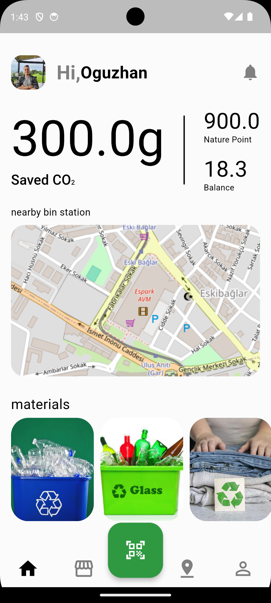
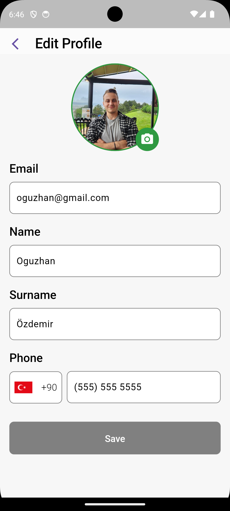
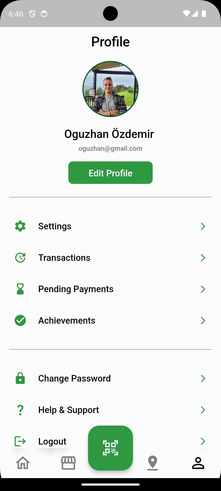

# GreenScore

The greenScore app aims to promote eco-friendly habits and effective waste management. Users can register with their email addresses and passwords, edit their profiles, and receive real-time updates. The app allows users to scan QR codes on products for recycling information and find nearby recycling points on the map. Additionally, users can evaluate product recyclability by scanning product images using Gemini AI. The app is built with Flutter and Firebase, following Clean Architecture principles. 🌿🌎

## Features

1. **Registration and Login Screen:**

   - Users can register for the application using their email addresses and passwords.
   - Password validation is implemented for security.
   - The login screen includes user authentication.

3. **Profile Editing and Real-Time Updates:**
   

         
         

   

   
   - Users can edit their profile information.
   - They can also upload profile pictures.
   - Real-time updates allow users to keep their profile information current.

5. **Product Scanner and Recycling Points:**
   - Users can scan QR codes to retrieve recycling information for products.
   - They can view nearby recycling points on a map.

6. **Product Assessment with Gemini AI:**
   - Users can directly scan a product image to determine if it is suitable for recycling based on information provided by Gemini AI.
   - They can also view the recycling type and suitable points.

## Technology and Architecture

- The application is built using Flutter and supported by Firebase.
- It follows Clean Architecture principles.
- State management tools such as River and Provider are used.

## Installation

1. Clone the application:
